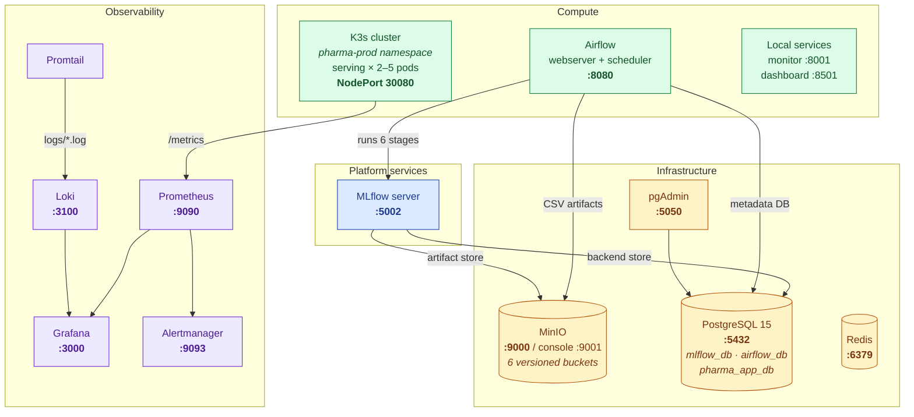
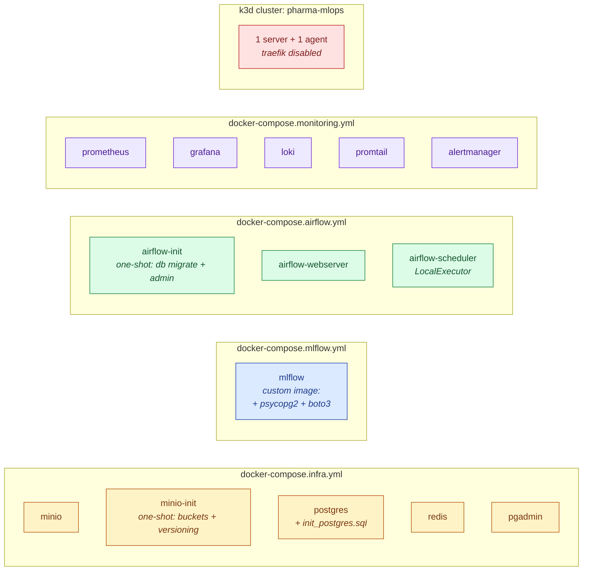
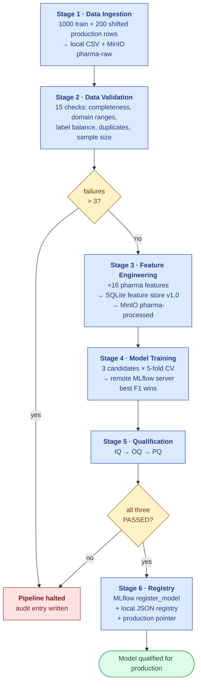
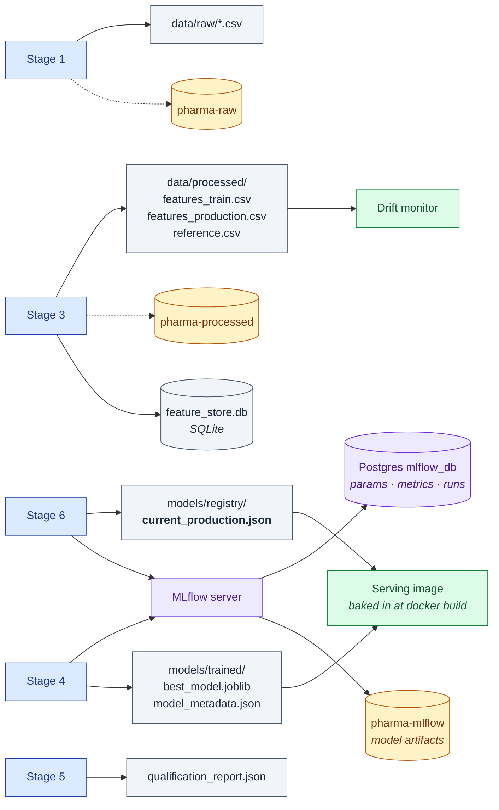
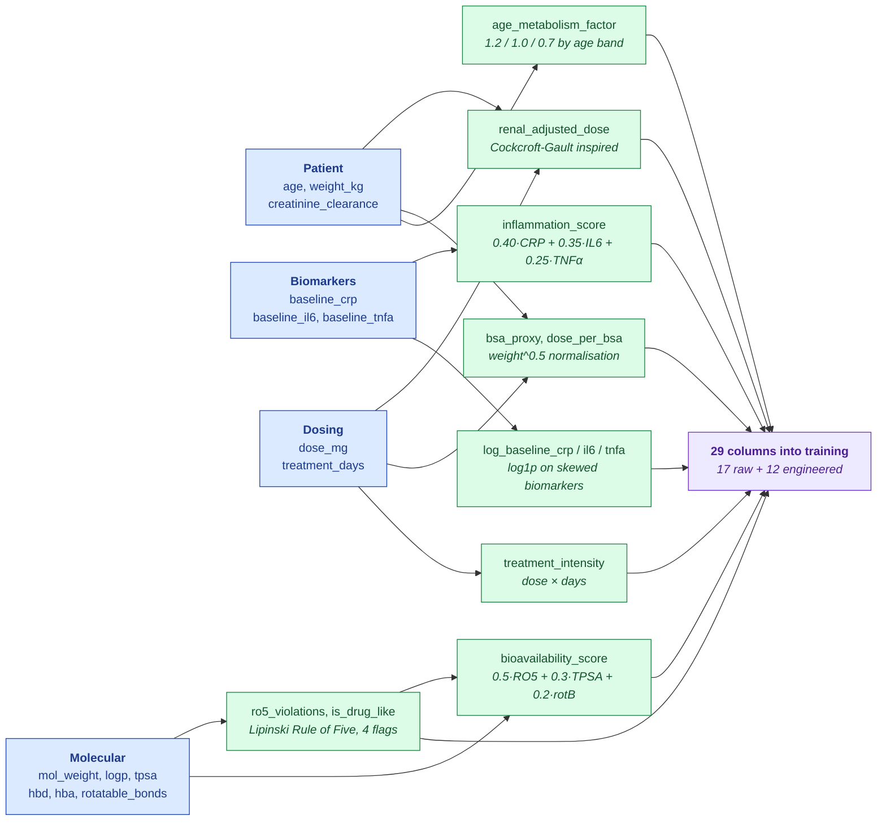
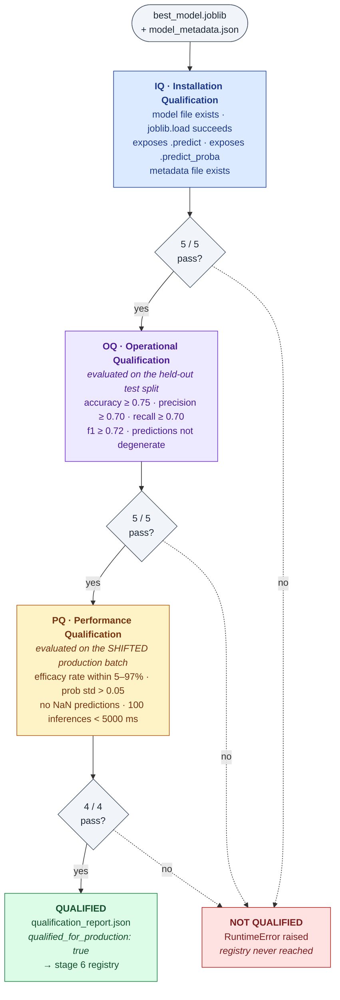
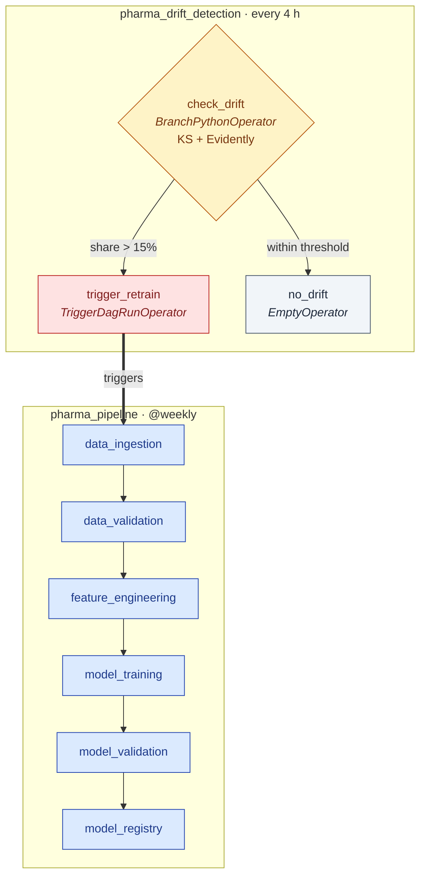
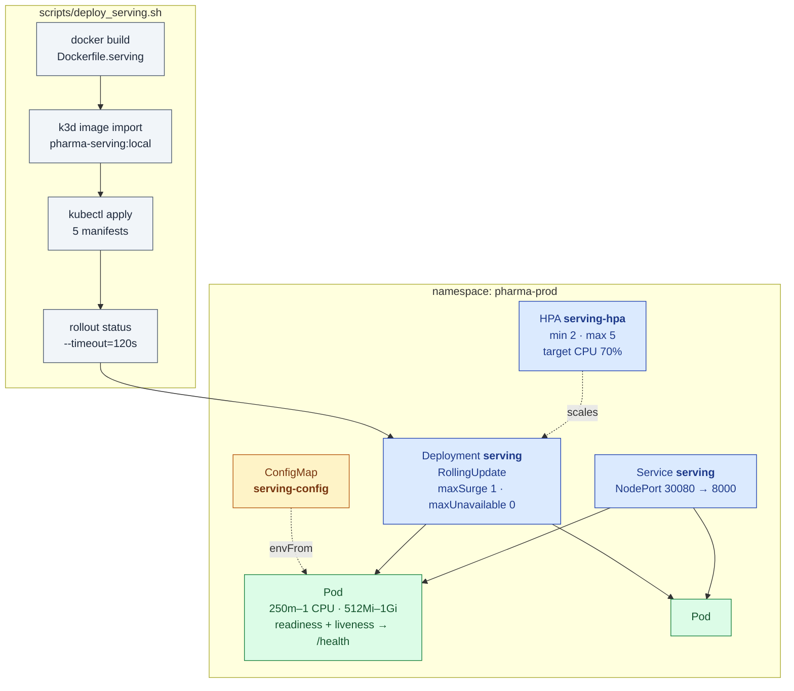
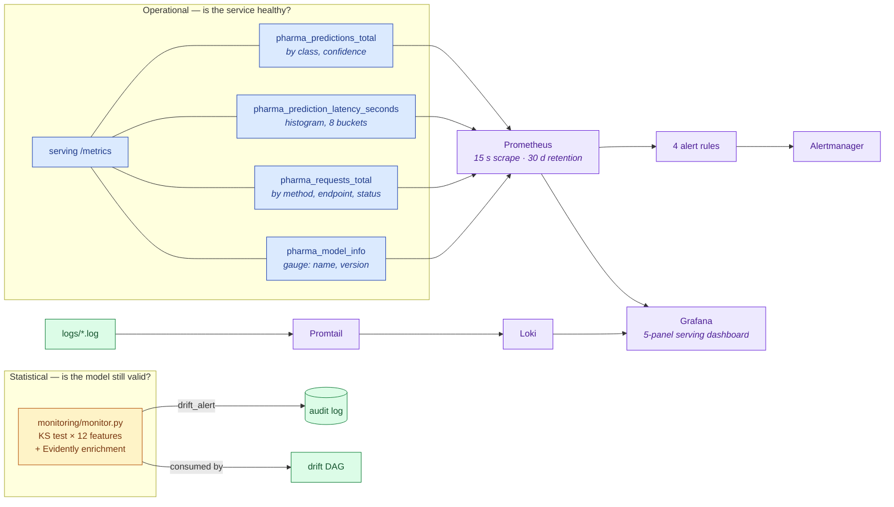

# Pharma MLOps — Drug Efficacy Pipeline

An end-to-end MLOps platform for a regulated setting. It trains a drug-efficacy classifier through six gated stages, holds every model to a pharma-style **IQ/OQ/PQ qualification protocol** before it can be registered, and runs on a local cloud-native stack: MinIO object storage, PostgreSQL, a remote MLflow server, Airflow scheduling, a K3s cluster with autoscaling, and a Prometheus/Grafana/Loki observability layer.

Every stage writes to an append-only, GxP-style audit trail.

**Stack:** scikit-learn · MLflow · MinIO · PostgreSQL · Airflow · Docker Compose · k3d/K3s · Prometheus · Grafana · Loki · Alertmanager · Evidently · FastAPI · Streamlit · DVC

---

## Table of contents

- [Why this exists](#why-this-exists)
- [Platform architecture](#platform-architecture)
- [Infrastructure layout](#infrastructure-layout)
- [The pipeline](#the-pipeline)
- [Storage: where every artifact lands](#storage-where-every-artifact-lands)
- [Feature engineering](#feature-engineering)
- [The qualification gate: IQ / OQ / PQ](#the-qualification-gate-iq--oq--pq)
- [Orchestration with Airflow](#orchestration-with-airflow)
- [Serving on Kubernetes](#serving-on-kubernetes)
- [Observability](#observability)
- [Audit trail](#audit-trail)
- [Design decisions](#design-decisions)
- [Getting started](#getting-started)
- [Ports and credentials](#ports-and-credentials)
- [Project layout](#project-layout)
- [Testing](#testing)
- [Known issues](#known-issues)

---

## Why this exists

Most MLOps demos stop once a model trains and an API serves it. In pharma that's the easy half. The hard half is showing that a model is fit for use, and being able to reconstruct later which data, code, and metrics produced the artifact now in production.

The project grew in two phases, and the git history shows both:

1. **Local core** (`init`). A six-stage pipeline with validation gates, a qualification protocol, drift detection, and an audit log, all on the local filesystem.
2. **Cloud-native platform** (the next 14 commits). The same pipeline code, now writing to object storage and a remote tracking server, scheduled by Airflow, served from Kubernetes, and watched by a metrics and logging stack.

The pipeline stages stayed almost the same across that migration, apart from the storage and tracking wiring. That was intentional (see [design decision 1](#design-decisions)).

| Regulated concept | Implementation |
|---|---|
| **Data contracts** | 15 range, completeness, and balance checks that block the pipeline when more than 3 fail |
| **IQ**: Installation Qualification | The model loads, isn't corrupted, and exposes the required interface |
| **OQ**: Operational Qualification | Metrics meet thresholds written in config before the run |
| **PQ**: Performance Qualification | The model behaves sensibly and fast enough on shifted production-like data |
| **Audit trail** | Append-only JSONL with a timestamp and actor for every state transition |
| **Immutable artifacts** | Versioning turned on for all six MinIO buckets |
| **Model provenance** | MLflow run ID → registry entry → production pointer → `pharma_model_info` metric |

---

## Platform architecture

Four layers. Each one depends only on the layers below it.



Everything shares one Docker network, `pharma-net`. The infrastructure compose file creates it, and the MLflow, Airflow, and monitoring compose files attach to it with `external: true`. So you must start infrastructure first, and any layer above it can be stopped and restarted on its own.

---

## Infrastructure layout

Four compose files split along lifecycle boundaries, plus a k3d cluster that runs K3s inside Docker. All four compose stacks join the same `pharma-net` bridge network.



The first run of Postgres executes [`infra/init_postgres.sql`](infra/init_postgres.sql). It creates three databases, each with its own owner role, so MLflow, Airflow, and the application never share credentials or schemas.

---

## The pipeline

Six stages. Each stage is a module that exposes `run()`, can be run on its own, and reads its inputs from storage instead of from the previous stage's return value.



The pipeline has two hard gates and no override flag. The same stage files run under three orchestrators, `run.py`, the Airflow DAG, and `dvc repro`, and none of those orchestrators knows about the others.

The last recorded run chose a **random forest with test F1 = 0.9863** ([`models/trained/model_metadata.json`](models/trained/model_metadata.json)). The labels come from a deterministic function of the input features plus bounded noise, so a high score is expected on this synthetic data. It shouldn't be read as a claim about real trials.

---

## Storage: where every artifact lands

This diagram is the one an auditor would ask for. It shows where each stage writes, and which storage tier the downstream consumer reads from.



In the diagram, a solid arrow means the stage requires that write, and a dotted arrow means the write is best-effort. That split is on purpose. MinIO uploads sit inside `try/except`, so if object storage is down you get a warning and the local file is still written. Downstream consumers read the local copy. MinIO is the durable, versioned record, not a hard dependency in the hot path.

Six buckets exist: `pharma-raw`, `pharma-processed`, `pharma-models`, `pharma-mlflow`, `pharma-audit`, and `pharma-features`. The pipeline currently writes to `raw`, `processed`, and `mlflow`. The other three are provisioned ahead of time for model, audit, and feature-store offload.

---

## Feature engineering

Seventeen raw columns produce sixteen derived features. Each one comes from a pharmacology idea, not a generic transform.



The serving API re-implements these same transforms in `add_engineered_features()`. A client only has to send the 17 raw inputs.

---

## The qualification gate: IQ / OQ / PQ

This protocol comes from pharmaceutical equipment validation. There are three separate sets of checks, run in order, and all three must pass.



Each layer asks a different question, which is why you need all three:

- **IQ: is the artifact intact?** A corrupted joblib file, or a model with no `predict_proba`, fails here before any metric is computed.
- **OQ: does it meet the spec?** The thresholds come from `config/config.yaml` and are set before the run. A model can't lower the bar it's measured against.
- **PQ: does it hold up in the field?** These checks run on the shifted production batch, not the test split. They catch cases that OQ's aggregate metrics miss: a model that always predicts one class, probabilities piled up at 0 and 1, or inference too slow to serve.

---

## Orchestration with Airflow

Two DAGs run the pipeline as scheduled jobs. The drift DAG can trigger the pipeline DAG.



The pipeline trains on a weekly baseline schedule. Drift can start an extra run between those weekly runs. Both DAGs have `catchup=False`, so a scheduler that was down for a month won't replay a month of runs when it comes back. Each task gets one retry, with a 2-minute delay for pipeline tasks and 5 minutes for drift checks.

The drift branch writes `drift_share`, `drift_detected`, and `drifted_columns` to XCom and to the audit log **before** it picks a branch. The decision is recorded even when it's `no_drift`.

`pipelines/retrain_trigger.py` still exists as a polling watchdog for runs without Airflow. It uses the same threshold and adds a 300-second cooldown.

---

## Serving on Kubernetes

The inference API runs as a Deployment on a local K3s cluster, managed by k3d.



The container runs as a non-root user (uid 1000), has a Docker `HEALTHCHECK`, and uses `imagePullPolicy: Never` because images are loaded into the cluster directly and there's no registry. `maxUnavailable: 0` means a rollout never drops below the current replica count. A new pod has to pass its readiness probe before an old one is removed.

<details>
<summary><b>Serving API endpoints</b></summary>

<br/>

| Method | Endpoint | Purpose |
|---|---|---|
| `GET` | `/health` | Liveness, plus the loaded model's name and version |
| `GET` | `/metrics` | Prometheus exposition |
| `GET` | `/model/info` | The full registry entry for the model being served |
| `POST` | `/predict` | A single prediction with probability and confidence band |
| `POST` | `/predict/batch` | Batch prediction; an error in one sample doesn't fail the rest |
| `GET` | `/predictions/recent` | Recent predictions from the in-memory log |
| `POST` | `/model/reload` | Reload the model from the registry pointer |

Inputs are validated with Pydantic `Field` bounds set to pharmacologically sensible ranges: `mol_weight` 50–1000 Da, `patient_age` 18–100, `creatinine_clearance` 10–200 mL/min. Out-of-range input returns a 422 before it reaches the model. The confidence band is high at ≥ 0.80 and medium at ≥ 0.60.
</details>

---

## Observability

There are two kinds of monitoring here and they answer different questions. **Operational** monitoring asks whether the service is healthy. **Statistical** monitoring asks whether the model is still valid.



| Alert | Expression | For | Severity |
|---|---|---|---|
| `ServingAPIDown` | `up{job="serving-api"} == 0` | 1 m | critical |
| `HighPredictionLatency` | p99 of `pharma_prediction_latency_seconds` > 2 s | 5 m | warning |
| `HighErrorRate` | `rate(pharma_requests_total{status="500"}[5m])` > 0.01 | 5 m | warning |
| `NoPredictionsReceived` | `rate(pharma_predictions_total[30m]) == 0` | 30 m | warning |

The Grafana dashboard, **Pharma MLOps: Model Serving**, has five panels: prediction rate, p99 latency, an effective vs. ineffective split, a p50/p95/p99 latency time series, and API up/down.

`NoPredictionsReceived` is the alert that matters most in a clinical setting. A serving API can be up and fast while an upstream caller has quietly stopped sending requests. Nothing is technically broken, but nothing is being used.

---

## Audit trail

Every meaningful state transition appends one line to `audit/audit_YYYYMMDD.jsonl`. Lines are never rewritten.

```json
{
  "timestamp": "2026-04-21T04:53:22.678Z",
  "actor": "pipeline",
  "event": "model_validated",
  "details": { "iq": "PASSED", "oq": "PASSED", "pq": "PASSED", "overall": "QUALIFIED" },
  "system": "pharma-mlops",
  "version": "1.0.0"
}
```

| Event | Emitted by |
|---|---|
| `pipeline_started` · `pipeline_completed` · `pipeline_failed` | orchestrator |
| `data_ingested` · `data_validated` · `features_engineered` | stages 1–3 |
| `model_trained` · `model_validated` · `model_registered` | stages 4–6 |
| `prediction_made` · `batch_prediction_made` | serving API |
| `drift_check_completed` | Airflow drift DAG |
| `drift_alert` | monitor service |
| `retrain_triggered` · `retrain_completed` · `retrain_failed` | retrain watchdog |

`model_trained` records the MLflow run ID, and `model_registered` records the same ID against a version. Together they let you trace any prediction back to the exact experiment, parameters, and feature list behind it.

---

## Design decisions

<details>
<summary><b>1. Migrate the platform, not the pipeline</b></summary>

<br/>

The move to a cloud-native stack changed four things in the pipeline code. Two stages got a MinIO upload block, and two stages swapped `sqlite:///mlflow.db` for the configured tracking URI. Validation, qualification, monitoring, and the retrain logic were left untouched.

That keeps the qualification protocol's validated behavior intact across the move. In a regulated setting, rewriting validated logic during an infrastructure change means validating it again. The infrastructure changes around the pipeline and the pipeline stays the same.
</details>

<details>
<summary><b>2. Best-effort object storage, local-first reads</b></summary>

<br/>

Every MinIO write is wrapped in `try/except` and logs a warning when it fails. Every stage still writes its local file first and reads from local files.

That keeps storage outages out of the pipeline's failure modes. With MinIO down, the pipeline still trains, qualifies, and registers a model. You lose the durable versioned copy but not the run.

**Trade-off:** it's possible to finish a run with nothing in object storage. The only sign is a warning in the logs. A production version would turn a failed upload into a `data_ingested` audit field, or block registration.
</details>

<details>
<summary><b>3. Versioning on every bucket</b></summary>

<br/>

`minio-init` enables versioning on all six buckets when they're created. Re-running stage 1 overwrites `drug_trials_train.csv`, and MinIO keeps the earlier version. Combined with the audit log's timestamps, you can recover the exact bytes a past model was trained on without depending on DVC.
</details>

<details>
<summary><b>4. One Postgres, three isolated databases</b></summary>

<br/>

MLflow, Airflow, and the application each get their own database and owner role. One container keeps local resource use low. Separate roles mean a compromised or misconfigured Airflow can't read or drop MLflow's experiment history. The split also matches how these would be deployed later: three managed databases, with no schema changes needed.
</details>

<details>
<summary><b>5. MLflow with the <code>--serve-artifacts</code> proxy</b></summary>

<br/>

The MLflow server runs with `--artifacts-destination s3://pharma-mlflow/ --serve-artifacts`. Clients upload and download artifacts through the MLflow server itself, not straight to MinIO.

As a result, the pipeline and any other MLflow client only need the tracking URI. They don't need S3 credentials or the MinIO endpoint. Postgres holds run metadata and MinIO holds model binaries. The custom `Dockerfile.mlflow` is two lines and just adds the `psycopg2` and `boto3` drivers.
</details>

<details>
<summary><b>6. Split compose files along lifecycle lines</b></summary>

<br/>

Infrastructure, MLflow, Airflow, and monitoring each have their own compose file, joined by an external network. They change at very different rates. You might restart Airflow ten times while debugging a DAG without ever wanting to bounce Postgres. Separate files let `make airflow-down` stop Airflow and leave everything else running.

**Trade-off:** startup order matters, and nothing enforces it across files. Infrastructure has to be up first so `pharma-net` exists.
</details>

<details>
<summary><b>7. Airflow calls the same stage files through <code>importlib</code></b></summary>

<br/>

The DAGs have no pipeline logic of their own. Each `PythonOperator` loads `/opt/airflow/project/pipelines/NN_*.py` with `importlib.util.spec_from_file_location` and calls `run()`. The project directory is bind-mounted into the container.

Stage files begin with digits, so a normal `import` won't work. `importlib` avoids that, and it means `run.py`, `retrain_trigger.py`, and the DAG all run the same file. A stage fixed locally is fixed in Airflow without redeploying anything.
</details>

<details>
<summary><b>8. Drift triggers a DAG run instead of retraining inline</b></summary>

<br/>

The drift DAG doesn't retrain anything itself. It uses `TriggerDagRunOperator` to start `pharma_pipeline` with `wait_for_completion=False`. Each retrain then shows up as a normal pipeline run in the Airflow UI, with the same six tasks, retries, and logs as a scheduled run. A drift-triggered model and a weekly model look the same to anyone reviewing them later.
</details>

<details>
<summary><b>9. Zero-downtime rolling updates, two-replica floor</b></summary>

<br/>

`maxUnavailable: 0` plus `maxSurge: 1` means a rollout adds one new pod, waits for it to pass readiness, and only then removes an old pod. The HPA floor is 2 replicas, so one pod crashing or being rescheduled never takes inference offline. The ceiling is 5 at 70% CPU. Inference here is CPU-bound sklearn, so CPU is an honest scaling signal.
</details>

<details>
<summary><b>10. Metrics labelled for clinical questions</b></summary>

<br/>

`pharma_predictions_total` has `prediction_class` and `confidence` labels. Without them the counter could only answer "how much traffic?". With them it can answer "has the share of low-confidence predictions gone up?" or "has the effective-vs-ineffective ratio moved?". Those are early warning signs of drift, and you get them from operational metrics before the statistical monitor runs.

`pharma_model_info` is a gauge fixed at 1, with the model name and version as labels. That lets any Grafana panel be joined to the model version that produced it.
</details>

<details>
<summary><b>11. Thresholds declared in config, never derived from the run</b></summary>

<br/>

`min_accuracy`, `min_precision`, `min_recall`, `min_f1`, and `max_drift_score` all live in `config/config.yaml`. A model is never judged against a bar calculated from its own results. Changing an acceptance criterion shows up in `git log` as a change to the spec, which is how change control is supposed to work.
</details>

<details>
<summary><b>12. PQ runs on the shifted batch, on purpose</b></summary>

<br/>

Stage 1 shifts the production batch on purpose, multiplying `patient_age` by 1.1 and `baseline_crp` by 1.4. PQ runs against that batch. Test-split metrics come from the training distribution and can't tell you how the model does on tomorrow's patients. PQ catches a model that scores well on held-out data but collapses to a single class once the inputs move.
</details>

---

## Getting started

The shell scripts target **macOS or Linux** (`bash`, Homebrew). On Windows, run them from WSL2.

**1. Check prerequisites and create the cluster**

```bash
make prereqs
```

```bash
make k3d
```

**2. Bring up the platform, in order**

```bash
make infra-up
```

```bash
make mlflow-up
```

```bash
make airflow-init
```

```bash
make airflow-up
```

```bash
make monitoring-up
```

**3. Run the pipeline, then deploy serving**

```bash
pip install -r requirements.txt
```

```bash
make pipeline
```

```bash
make deploy-serving
```

Build the serving image **after** the pipeline has run. The image copies `models/` in at build time, and `models/registry/` only exists once stage 6 has finished.

**4. Try a prediction**

```bash
curl -X POST http://localhost:30080/predict -H "Content-Type: application/json" -d '{"mol_weight":420,"logp":3.1,"tpsa":88,"hbd":2,"hba":6,"patient_age":58,"patient_weight_kg":78,"dose_mg":200,"treatment_days":30}'
```

See [known issues](#known-issues) about reaching NodePort 30080 from the host.

**Without the platform:** the pipeline also runs purely locally with `python run.py`, `python serving/serve.py`, `python monitoring/monitor.py`, and `streamlit run ui/dashboard.py`. Point `mlflow.tracking_uri` in `config/config.yaml` at a local store first.

---

## Ports and credentials

| Service | URL | Default credentials |
|---|---|---|
| MinIO API / console | `:9000` / `:9001` | `minioadmin` / `minioadmin123` |
| PostgreSQL | `:5432` | `pharmaadmin` / `pharmapass123` |
| pgAdmin | `:5050` | `admin@pharma.com` / `admin123` |
| Redis | `:6379` | none |
| MLflow | `:5002` | none |
| Airflow | `:8080` | `admin` / `admin` |
| Serving (K3s) | `:30080` | none |
| Monitoring API | `:8001` | none |
| Streamlit | `:8501` | none |
| Prometheus | `:9090` | none |
| Grafana | `:3000` | `admin` / `admin123` |
| Loki | `:3100` | none |
| Alertmanager | `:9093` | none |

> **These are local-development defaults and they're committed in plaintext.** That includes the Airflow Fernet key and the MinIO keys in the Kubernetes ConfigMap. Move them to a `.env` file or Kubernetes Secrets before exposing anything beyond localhost.

---

## Project layout

```
Mlops-pipeline/
├── Makefile                        Entry point for every workflow
├── run.py                          Local orchestrator, all 6 stages via importlib
├── dvc.yaml                        Same DAG, declared for `dvc repro`
│
├── config/
│   ├── config.yaml                 Paths, MinIO buckets, MLflow URI, thresholds, ports
│   ├── storage.py                  boto3 wrapper: upload/download CSV & files, key_exists
│   └── utils.py                    load_config, get_logger, audit_log, ensure_dirs
│
├── pipelines/
│   ├── 01_data_ingestion.py        Synthetic generator → local + MinIO
│   ├── 02_data_validation.py       PharmaDataValidator, 15 checks
│   ├── 03_feature_engineering.py   Pharma features, SQLite feature store, MinIO
│   ├── 04_model_training.py        3 candidates → remote MLflow
│   ├── 05_model_validation.py      PharmaQualificationProtocol: IQ/OQ/PQ
│   ├── 06_model_registry.py        MLflow registry + local JSON pointer
│   └── retrain_trigger.py          Airflow-less drift watchdog
│
├── dags/
│   ├── phrama_pipeline_dag.py      @weekly: 6 chained PythonOperators
│   └── pharma_drift_detection_dag.py  Every 4 h: branch → trigger pipeline
│
├── serving/serve.py                FastAPI + Prometheus instrumentation
├── monitoring/
│   ├── monitor.py                  KS + Evidently drift API
│   ├── prometheus/                 Scrape config + 4 alert rules
│   ├── alertmanager/
│   ├── grafana/                    Datasources, provisioning, serving dashboard
│   ├── loki/
│   └── promtail/
│
├── docker/                         Dockerfile.mlflow, Dockerfile.serving
├── docker-compose.{infra,mlflow,airflow,monitoring}.yml
├── kubernetes/serving/             namespace, configmap, deployment, service, hpa
├── infra/                          Prereq check, k3d install, Postgres init, pgAdmin
├── scripts/deploy_serving.sh       Build → import → apply → rollout
├── ui/dashboard.py                 Streamlit, 6 pages
└── tests/test_pipeline.py          63 tests across 10 classes
```

---

## Testing

```bash
make test
```

The 63 tests in [`tests/test_pipeline.py`](tests/test_pipeline.py) cover ingestion, validation, feature engineering, training, qualification, the registry, monitoring, serving, the audit log, and a full end-to-end run. The end-to-end test points MLflow at a temporary `file://` store, so the suite doesn't need the platform to be running.

---

## Known issues

Found by reading the committed configuration. They're listed here so the gaps between the design above and what actually runs are clear.

**Platform wiring**

- **The Airflow containers don't have the pipeline's dependencies.** `airflow-init` runs `pip install mlflow scikit-learn …`, but that's a one-off container. The webserver and scheduler start from the plain `apache/airflow` image and won't have those packages. Fix by setting `_PIP_ADDITIONAL_REQUIREMENTS` on the shared anchor, or by building a custom image.
- **Stage 4 overrides the container's MLflow URI.** The Airflow compose file sets `MLFLOW_TRACKING_URI=http://mlflow:5000`, but `04_model_training.py` calls `mlflow.set_tracking_uri(cfg["mlflow"]["tracking_uri"])`, which is `http://localhost:5002`. Inside a container that address is the container itself. The MinIO endpoint has the same problem.
- **The Grafana dashboard isn't provisioned.** Compose mounts `./monitoring/grafana/dashboards`, but the directory in the repo is `monitoring/grafana/dashboard`, without the `s`.
- **Prometheus can't reach two of its targets.** `mlflow:5000/metrics` needs MLflow to be started with `--expose-prometheus`, and the `node` job has no node-exporter service defined.
- **NodePort 30080 isn't published to the host.** `install_k3d.sh` maps only ports 80 and 443, so both `curl localhost:30080` and Prometheus's `host.docker.internal:30080` scrape need an extra `--port "30080:30080@server:0"`.
- **Alertmanager has no real receiver.** Its webhook points back at its own removed v1 API, so alerts fire but aren't delivered anywhere.

**Serving**

- **The model is baked into the image.** `serve.py` reads the registry JSON copied in at build time and doesn't use the MLflow variables in the ConfigMap. `POST /model/reload` inside a pod reloads the same file, so a new model means a new image and a rollout.
- **Each pod keeps its own in-memory prediction log.** `/predictions/recent` returns a different answer depending on which replica handles the request.
- **Train/serve skew in `inflammation_score`.** Training normalizes by the dataset maximum, while serving divides by the fixed constants 80, 200, and 300.

**Housekeeping**

- `pipelines/run_pipeline.py` fails with a `SyntaxError`, because its `*_mod.py` shims use `from pipelines.01_…`. Use `make pipeline`, which runs `run.py`.
- `ui/dashboard.py` and the `run.py` completion banner still point at MLflow on port 5000. It's on 5002 now.
- The Makefile advertises `verify-day1`, which has no target, and `verify-day6` calls `infra/verify_day6.sh`, which doesn't exist.

---

## License

For educational and demonstration use. Not validated for clinical use or regulatory submission.
